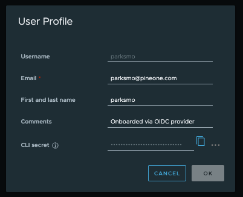

# Horbor에 이미지 업로드

1. 로그인 
    1. docker login <harbor-host> -u <username> -p <password>
    2. docker login [dev.pineone.com:20444](http://dev.pineone.com:20444/) -u parksmo -p zVPzYn3AaVudKqRpqtw7zdSXeqfas7rp
        1. 비밀번호는 아래와 같이 Horbor 프로필에서 획득
            
            [https://dev.pineone.com:20444/harbor/projects/20/repositories](https://dev.pineone.com:20444/harbor/projects/20/repositories)
            
            
            
2. 푸시 
    1. Harbor로 푸시하려면 보통 docker tag로 Harbor 경로까지 포함한 이름을 로컬 이미지에 “태그”로 붙인 뒤 푸시해야 함. 이유는 docker push가 기본적으로 “어디 레지스트리/어떤 리포지토리 이름으로 올릴지”가 이름에 포함되어야 하기 때문
        
        즉, arbor에 올리려는 경우: docker push에 반드시 [dev.pineone.com:20444/uplus-mready/](http://dev.pineone.com:20444/uplus-mready/)... 형태(호스트/프로젝트/REPOSITORY) 가 들어가야 함
        
    2. Tag an image for this project:
        1. docker tag SOURCE_IMAGE[:TAG] [dev.pineone.com:20444/uplus-mready/REPOSITORY[:TAG]](http://dev.pineone.com:20444/uplus-mready/REPOSITORY%5B:TAG%5D)
    3. Push an image to this project:
        1. docker push [dev.pineone.com:20444/uplus-mready/REPOSITORY[:TAG]](http://dev.pineone.com:20444/uplus-mready/REPOSITORY%5B:TAG%5D)