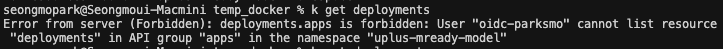

# 개발기 K8S에 이미지 배포

1. deployment.yml 배포
    1. 배포를 위해서는 deployement 권한이 있어야 함
        1. 아래와 같이 명령어 수행시 오류나면 권한 없음
            
            k get deployments
            
            
            
        2. 서버 담당자에게 권한 받은 후 아래와 같이 오류가 없어야 정상
            
            
            
        3. 권한이 부여되었기 때문에 현재 문제 없음
    2. yml 파일 생성
        1. Horbor에서 이미지를 받아오기 위한 Secret 설정
            1. 이미 서버에서 등록한 Secret(harbor)이 있음
                1. yml 파일에 아래와 같이 설정
                    
                    
                    
    3. 배포 
        1. 명령어 : k apply -f k8s/deployment.yaml -n uplus-mready-model
            
            
            
    4. 배포 여부 확인 
        1. 명령어 : k get pods -n uplus-mready-model -l app=fastapi-greet
            
            
            
    5. 설명/이벤트 확인 
        1. 명령어 : k describe pod
    6. 실시간 로그 확인 
        1. 명령어 : k logs -f <pod_name>
    7. deployment 삭제 
        1. 명령어 : k delete deployment fastapi-greet -n uplus-mready-model
    
2. service.yml 배포
    1. service.yml 작성
        1. type을 NodePort로 지정하여 외부에서 접근 가능함
        2. 외부에서 접근가능한 포트(32700~32767)는 서버 담당자로부터 확인
    2. 배포 
        1. 명령어 :  k apply -f k8s/service.yaml
            
            
            
    3. 배포 확인
        1. 명령어 : k get svc fastapi-greet -n uplus-mready-model -o wide
            
            
            
        2. 
    4. 테스트 
        1. health check 
            1. 명령어 : curl [http://192.168.1.243:32700/health](http://192.168.1.243:32700/health)
                
                
                
        2. API 호출 
            1. 외부에서 접근 가능한 서버 IP :  [http://192.168.1.243](http://192.168.1.243:32700/greet)
            2. 각자의 환경에 맞는 명령어로 호출
            
            curl -X POST [http://192.168.1.243:32700/greet](http://192.168.1.243:32700/greet) \
            -H "Content-Type: application/json" \
            -d '{"name":"Parksmo"}'
            
            
            